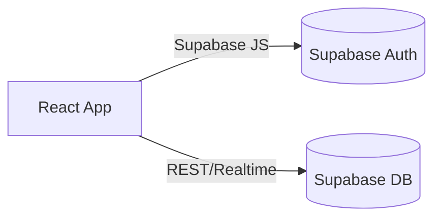

# FACODI – Faculdade Comunitária Digital

FACODI Digital Campus centraliza planos curriculares e materiais de apoio de cursos superiores, promovendo uma comunidade colaborativa de aprendizagem gratuita.

[](https://github.com/Moninhay/facodi-digital-campus/actions/workflows/ci.yml)
[](LICENSE)

[](https://vercel.com/)


## Sumário
- [Visão Geral](#visão-geral)
- [Stack e Arquitetura](#stack-e-arquitetura)
- [Instalação Local](#instalação-local)
- [Scripts npm](#scripts-npm)
- [Testes e CI/CD](#testes-e-cicd)
- [Deploy na Vercel](#deploy-na-vercel)
- [Como Contribuir](#como-contribuir)
- [Licença](#licença)

## Visão Geral
O projeto oferece catálogo de cursos, unidades curriculares e conteúdos selecionados. Usuários podem se inscrever em cursos, acompanhar progresso e interagir por comentários.

Principais páginas disponíveis:

- **Cursos** – lista e busca de cursos oferecidos.
- **Unidades** – catálogo filtrável de unidades curriculares.
- **Comunidade** – feed de comentários mais recentes.
- **Repositório** – materiais enviados pela comunidade para download.
- **Perfil** – área pessoal com cursos inscritos e progresso.

## Stack e Arquitetura
- **Frontend:** React + Vite + TypeScript
- **Estilo:** Tailwind CSS e shadcn-ui
- **Dados e Autenticação:** Supabase
- **Gerenciamento de estado:** TanStack Query

Arquitetura simplificada:



Detalhes adicionais estão em [docs/architecture.md](./docs/architecture.md).

## Instalação Local
1. Instale [Node.js](https://nodejs.org/) 20+ e [npm](https://www.npmjs.com/).
2. Instale o [Supabase CLI](https://supabase.com/docs/guides/cli):
   ```sh
   npm install -g supabase
   ```
3. Clone o repositório e instale dependências:
   ```sh
   git clone <repo-url>
   cd facodi-digital-campus
   npm install
   ```
4. Copie `.env.example` para `.env` e preencha com as chaves do seu projeto Supabase.
5. Aplique as migrações e rode o seed inicial:
   ```sh
   supabase db reset --linked
   npm run seed
   ```
6. Inicie o ambiente de desenvolvimento:
   ```sh
   npm run dev
   ```

## Scripts npm
- `npm run dev` – servidor de desenvolvimento
- `npm run build` – build de produção em `dist/`
- `npm run build:dev` – build no modo development
- `npm run preview` – pré-visualização do build
- `npm run lint` – análise estática com ESLint
- `npm test` – testes unitários com Vitest
- `npm run seed` – popula o banco com dados de exemplo

### Environment variables

Copy `.env.example` to `.env.local` and update the values with your Supabase project credentials:

```sh
cp .env.example .env.local
# then edit .env.local
```

`VITE_SUPABASE_URL` and `VITE_SUPABASE_ANON_KEY` are used in `src/integrations/supabase/client.ts` to connect the frontend with your Supabase instance.

## Continuous integration

This repository includes a GitHub Actions workflow at `.github/workflows/ci.yml` that runs linting and unit tests on every pull request.

## How can I deploy this project?

First create a production build:

```sh
npm run build
```

## Testes e CI/CD
Os testes podem ser executados localmente com `npm test`. Cada pull request dispara o workflow [CI](.github/workflows/ci.yml) que roda lint e testes automaticamente no GitHub Actions.

## Deploy na Vercel
Crie um build de produção e faça deploy do diretório `dist/` na [Vercel](https://vercel.com/). É possível conectar um domínio personalizado pelo painel da plataforma.

## Como Contribuir
1. Fork este repositório e crie um branch para sua feature ou correção.
2. Instale as dependências e siga as instruções de instalação.
3. Abra um pull request descrevendo suas mudanças.

Contribuições são bem-vindas! Confira também a documentação em [docs/api-hooks.md](./docs/api-hooks.md) e [docs/database-schema.md](./docs/database-schema.md).

## Licença
Este projeto está licenciado sob os termos da [Licença MIT](LICENSE).
=======
Uma plataforma **100 % gratuita** que organiza planos curriculares de cursos superiores usando conteúdo aberto (YouTube, PDFs, exercícios, repositórios públicos).
Qualquer pessoa pode “concluir” um curso de forma autônoma enquanto monitora seu progresso e colabora com a comunidade.

---

## ✨ Principais funcionalidades

| Módulo                      | Descrição                                                           |
| --------------------------- | ------------------------------------------------------------------- |
| **Autenticação**            | Login por Google ou e-mail (Supabase Auth)                          |
| **Catálogo de cursos**      | Lista de universidades e cursos com filtros por área/ECTS           |
| **Unidades curriculares**   | Sílabo, conteúdos recomendados, comentários e marcação de conclusão |
| **Progresso**               | Barra de conclusão por curso/unidade + painel no perfil             |
| **Repositório comunitário** | Upload/ download de materiais (Supabase Storage)                    |
| **Comunidade**              | Feed global de comentários, likes e tags                            |

---

## 🛠 Stack

| Camada             | Tecnologia                            |
| ------------------ | ------------------------------------- |
| **Frontend**       | React 18 (Vite + TypeScript)          |
| **UI/UX**          | TailwindCSS + shadcn/ui               |
| **Estado & Cache** | TanStack Query                        |
| **Auth & DB**      | Supabase (PostgreSQL + Storage)       |
| **Hospedagem**     | Vercel                                |
| **Testes**         | Vitest + React Testing Library        |
| **CI**             | GitHub Actions                        |
| **Lint/Format**    | ESLint + Prettier + Husky/lint-staged |

---

## ⚡ Instalação local

```bash
# 1. Clone o repositório
git clone https://github.com/Moninhay/facodi-digital-campus.git
cd facodi-digital-campus

# 2. Instale dependências
npm install     # ou pnpm install / yarn

# 3. Configure variáveis de ambiente
cp .env.example .env.local
# edite .env.local com suas chaves Supabase

# 4. Rode em modo desenvolvimento
npm run dev
```

> A aplicação abre em [http://localhost:5173](http://localhost:5173)

---

## 🔐 Variáveis de ambiente

| Chave                    | Descrição                          |
| ------------------------ | ---------------------------------- |
| `VITE_SUPABASE_URL`      | URL do projeto Supabase            |
| `VITE_SUPABASE_ANON_KEY` | API anon key do Supabase           |
| `VITE_SUPABASE_STORAGE`  | (opcional) bucket para repositório |

---

## 🗄️ Configuração do Supabase

1. **Crie um novo projeto** em [https://supabase.com](https://supabase.com).
2. **Execute o script `supabase/schema.sql`** (migra todas as 15 tabelas, enums, triggers e policies RLS).
3. **Popule dados de exemplo** rodando `supabase/seed.sql` *(Universidade do Algarve → Engenharia de Sistemas e Tecnologias Informáticas)*.
4. Crie um **bucket Storage** chamado `materiais` para uploads da comunidade.

---

## 👀 Scripts NPM úteis

| Comando    | Ação                      |
| ---------- | ------------------------- |
| `dev`      | inicia Vite em modo dev   |
| `build`    | gera bundle de produção   |
| `preview`  | pré-visualiza build local |
| `lint`     | eslint + formatter        |
| `test`     | roda Vitest               |
| `coverage` | abre relatório de testes  |

---

## 🚀 Deploy

> **Recomendado:** Vercel

1. Conecte seu repositório no painel Vercel.
2. Adicione as variáveis de ambiente acima em *Settings → Environment Variables*.
3. Clique em **Deploy**. A Vercel detecta Vite e cria o pipeline automático.

---

## 🧪 Qualidade & CI

* **GitHub Actions** executa `lint`, `test` e `build` a cada PR.
* **Vitest** cobre hooks críticos (`useAuth`, `useCursos`, etc.).
* Lighthouse ≥ 90 em performance e acessibilidade (lazy-load de rotas e imagens).

---

## 🤝 Contribuindo

1. Faça um fork do projeto.
2. Crie uma branch (`git checkout -b feature/minha-feature`).
3. Commit suas mudanças (`git commit -m 'feat: minha feature'`).
4. Push para o fork (`git push origin feature/minha-feature`).
5. Abra um **Pull Request**.

---

## 📄 Licença

Distribuído sob licença **MIT**. Veja `LICENSE` para mais informações.

---

> **FACODI** © 2025 – Uma iniciativa de educação aberta. Sinta-se livre para usar, estudar, copiar e compartilhar ❤️
