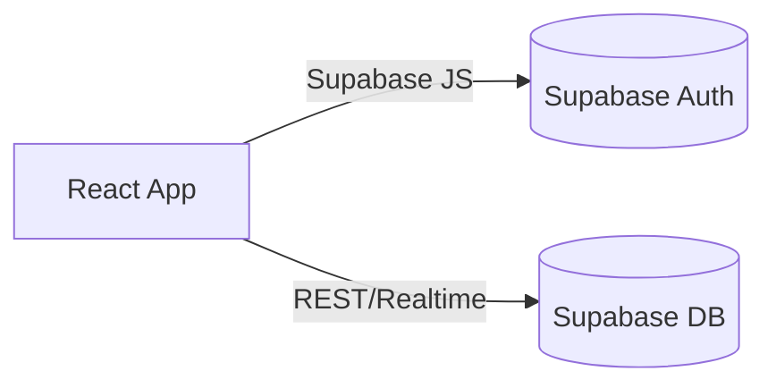

# FACODI – Faculdade Comunitária Digital

[](https://github.com/YOUR_ORG/YOUR_REPO/actions/workflows/ci.yml)
[](https://vercel.com/)
[](LICENSE)

FACODI Digital Campus centraliza planos curriculares e materiais de apoio de cursos superiores, promovendo uma comunidade colaborativa de aprendizagem gratuita.

## Sumário
- [Visão Geral](#visão-geral)
- [Stack e Arquitetura](#stack-e-arquitetura)
- [Instalação Local](#instalação-local)
- [Scripts npm](#scripts-npm)
- [Testes e CI/CD](#testes-e-cicd)
- [Deploy na Vercel](#deploy-na-vercel)
- [Como Contribuir](#como-contribuir)
- [Licença](#licença)

## Visão Geral
O projeto oferece catálogo de cursos, unidades curriculares e conteúdos selecionados. Usuários podem se inscrever em cursos, acompanhar progresso e interagir por comentários.

## Stack e Arquitetura
- **Frontend:** React + Vite + TypeScript
- **Estilo:** Tailwind CSS e shadcn-ui
- **Dados e Autenticação:** Supabase
- **Gerenciamento de estado:** TanStack Query

Arquitetura simplificada:



Detalhes adicionais estão em [docs/architecture.md](./docs/architecture.md).

## Instalação Local
1. Instale [Node.js](https://nodejs.org/) 20+ e [npm](https://www.npmjs.com/).
2. Instale o [Supabase CLI](https://supabase.com/docs/guides/cli):
   ```sh
   npm install -g supabase
   ```
3. Clone o repositório e instale dependências:
   ```sh
   git clone <repo-url>
   cd facodi-digital-campus
   npm install
   ```
4. Copie `.env.example` para `.env` e preencha com as chaves do seu projeto Supabase.
5. Aplique as migrações e rode o seed inicial:
   ```sh
   supabase db reset --linked
   npm run seed
   ```
6. Inicie o ambiente de desenvolvimento:
   ```sh
   npm run dev
   ```

## Scripts npm
- `npm run dev` – servidor de desenvolvimento
- `npm run build` – build de produção em `dist/`
- `npm run build:dev` – build no modo development
- `npm run preview` – pré-visualização do build
- `npm run lint` – análise estática com ESLint
- `npm test` – testes unitários com Vitest
- `npm run seed` – popula o banco com dados de exemplo

### Environment variables

Copy `.env.example` to `.env.local` and update the values with your Supabase project credentials:

```sh
cp .env.example .env.local
# then edit .env.local
```

`VITE_SUPABASE_URL` and `VITE_SUPABASE_ANON_KEY` are used in `src/integrations/supabase/client.ts` to connect the frontend with your Supabase instance.

## Continuous integration

This repository includes a GitHub Actions workflow at `.github/workflows/ci.yml` that runs linting and unit tests on every pull request.

## How can I deploy this project?

First create a production build:

```sh
npm run build
```

## Testes e CI/CD
Os testes podem ser executados localmente com `npm test`. Cada pull request dispara o workflow [CI](.github/workflows/ci.yml) que roda lint e testes automaticamente no GitHub Actions.

## Deploy na Vercel
Crie um build de produção e faça deploy do diretório `dist/` na [Vercel](https://vercel.com/). É possível conectar um domínio personalizado pelo painel da plataforma.

## Como Contribuir
1. Fork este repositório e crie um branch para sua feature ou correção.
2. Instale as dependências e siga as instruções de instalação.
3. Abra um pull request descrevendo suas mudanças.

Contribuições são bem-vindas! Confira também a documentação em [docs/api-hooks.md](./docs/api-hooks.md) e [docs/database-schema.md](./docs/database-schema.md).

## Licença
Este projeto está licenciado sob os termos da [Licença MIT](LICENSE).
