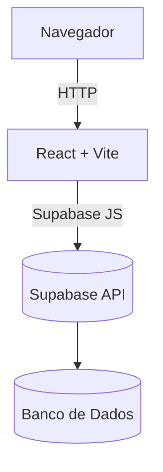
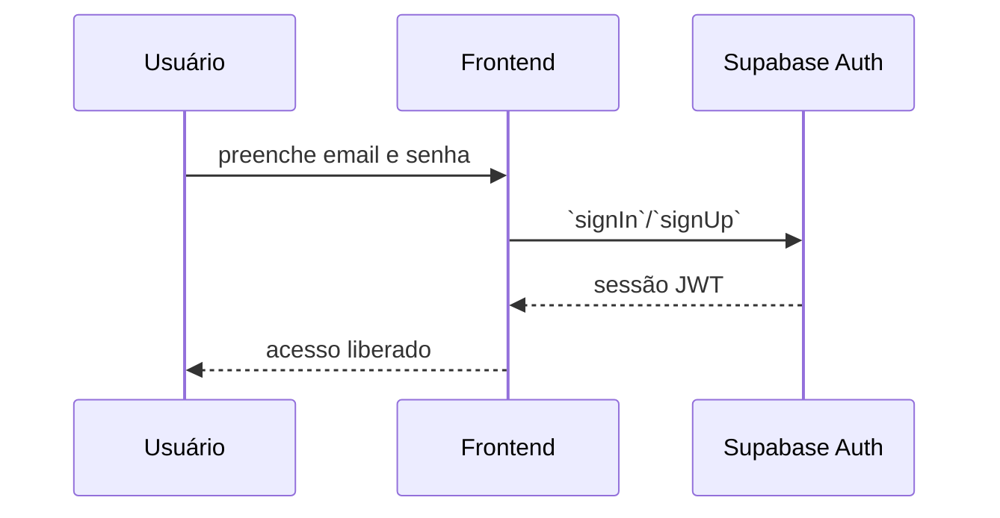
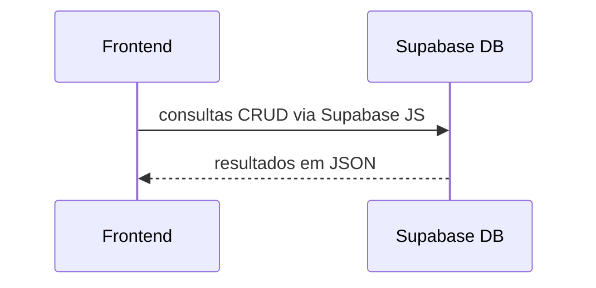

# Arquitetura

## Sumário
- [Visão Geral](#visão-geral)
- [Fluxo de Autenticação](#fluxo-de-autenticação)
- [Fluxo de Dados](#fluxo-de-dados)

## Visão Geral
O frontend é construído em React e comunica-se diretamente com o Supabase através do SDK oficial. Não há backend próprio; todo o armazenamento e autenticação ocorrem no Supabase.

## Fluxo de Autenticação

## Fluxo de Dados

Principais endpoints utilizados encontram-se nos hooks descritos em [api-hooks.md](./api-hooks.md).
