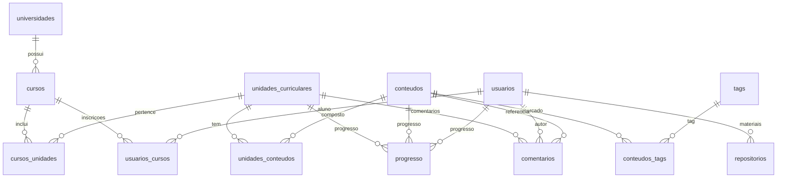

# Esquema do Banco de Dados

## Sumário
- [Diagrama ER](#diagrama-er)
- [Row-Level Policies](#row-level-policies)
- [Triggers Principais](#triggers-principais)
- [Seed Inicial](#seed-inicial)

## Diagrama ER

## Row-Level Policies
- **perfis**: usuários podem visualizar e atualizar apenas seu próprio perfil.
- **usuarios_cursos**: somente o usuário dono pode inserir ou alterar sua inscrição.
- **progresso**: acesso restrito ao usuário que gerou o registro.
- **comentarios**: qualquer pessoa pode ler; apenas o autor pode criar, editar ou remover.
- **repositorios**: leitura pública apenas para materiais aprovados; demais operações restritas ao autor.
- **blog_comments**: usuários autenticados podem criar e gerenciar seus próprios comentários.

## Triggers Principais
- Criação automática de perfil ao registrar novo usuário (`create_profile_for_new_user`).
- Atualização do campo `updated_at` em várias tabelas via `update_updated_at_column`.

## Seed Inicial
O script [`supabase/seed.sql`](../supabase/seed.sql) popula a base com dados da Universidade do Algarve, incluindo curso de Engenharia de Sistemas, unidades curriculares, conteúdos de exemplo e tags mais comuns.
